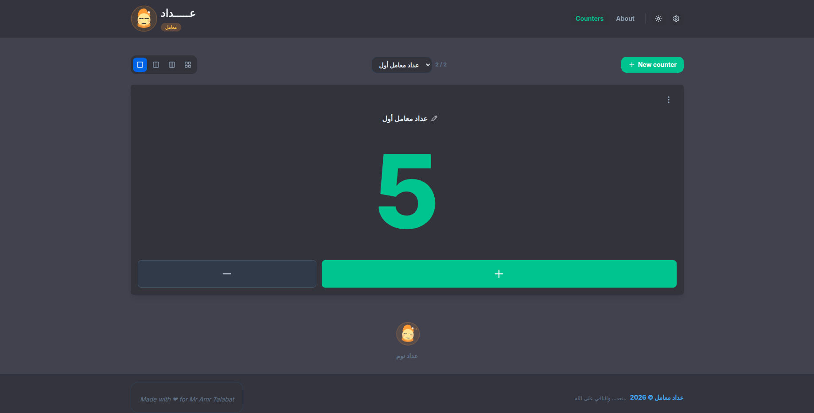
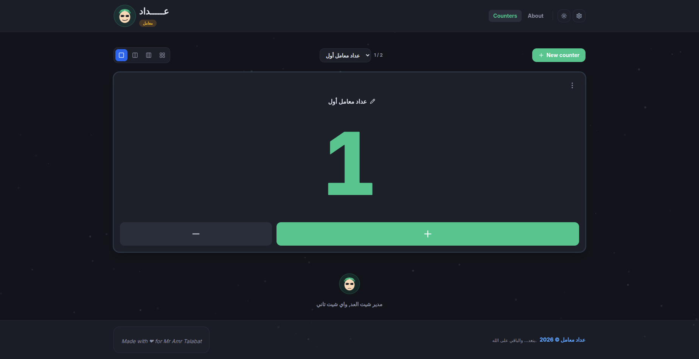
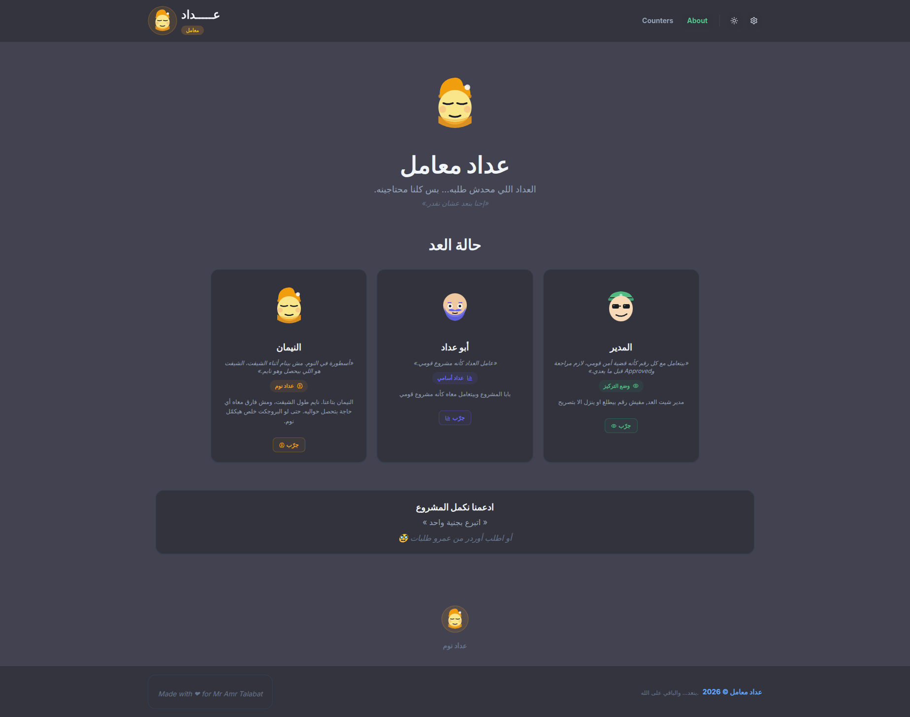
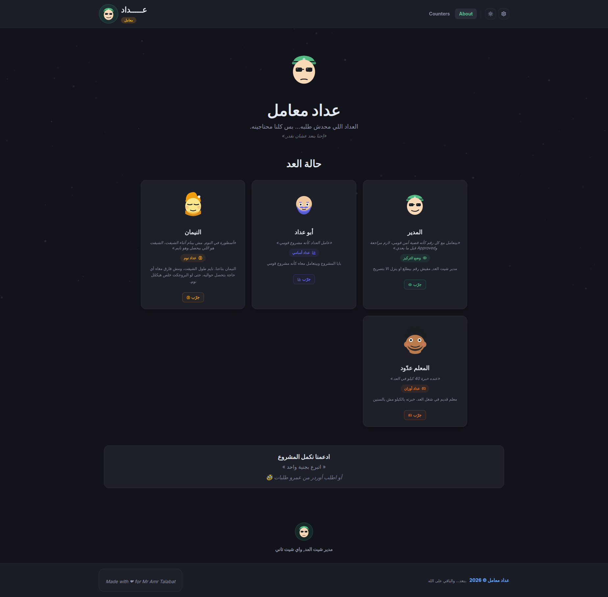

# عداد — Adaad

A simple counter made for my team. 😄

**Adaad** started as a small idea to help my friends at work keep track of their daily targets without relying on notes, calculators, or manually updating numbers on the side.

It gives us a quick place to create counters, track progress, and see where we are during the shift.

## 🖼️ Screenshots

### Home V1

### Home V2

### About V1

### About V2

## 😂 The Characters

The counter comes with a few characters inspired by my teammates and real jokes of them.

### 😴 النيمان

- The team's professional sleeper.

- He is always sleeping during the shift.

- That's basically his entire personality.

> **"هو في شيفت انهاردة؟ 😴**

 

### 👔 المدير

- The self-appointed manager of the sheet.

- No number goes up or down without his approval.

- His favorite questions:

> **"خدت ابروف على الرقم ده؟"**

Nobody officially made him the manager - He just became one. 😂

 

## ❤️ Why I Built It

This is a small project built specifically for my friends and our day-to-day work.

It's one of those projects that started with:

> "We need a simple counter - and somehow ended up with **أبو عداد، النيمان، والمدير**. 😂

 

**بنعد... والباقي على الله. عداد معامل © 2026**
